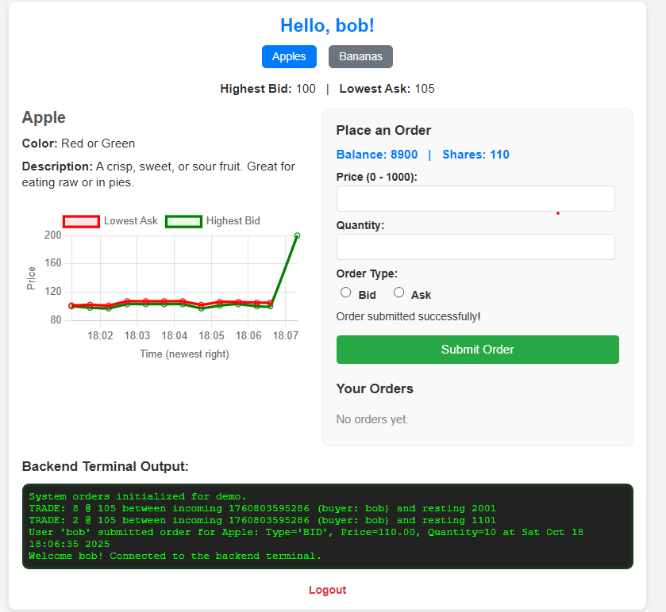

# Order Book Fullstack Demo

Simple HFT-style order book and small Flask + Socket.IO UI for demonstration and testing.



Brief:
- C++ core: compact OrderBook + matching engine (exposed to Python with pybind11).
- Python backend: Flask + Flask-SocketIO test server (testbackend.py).
- Frontend: minimal templates (fruit_page.html) with Chart.js price history and realtime terminal output.

Quick start (Windows, from project root)
1. Create & activate a virtual environment:
   - PowerShell:
     ```
     python -m venv .venv
     Set-ExecutionPolicy -Scope Process -ExecutionPolicy Bypass
     .\.venv\Scripts\Activate.ps1
     ```
   - Or CMD:
     ```
     python -m venv .venv
     .\.venv\Scripts\activate.bat
     ```

2. Install Python deps:
   ```
   python -m pip install --upgrade pip setuptools wheel pybind11 flask flask-socketio
   ```

3. Build the C++ extension (in-place):
   ```
   python setup.py build_ext --inplace
   ```
   - Ensure MSVC Build Tools are installed on Windows (Visual Studio «Desktop development with C++»).
   - If build fails, run: `python -m pip install -e .` after resolving compiler issues.

4. Run the server:
   ```
   python testbackend.py
   ```
   Open browser at http://127.0.0.1:5000 and login with one of the demo users:
   - testuser / password123
   - alice / alicepass
   - bob / bobpass

Notes
- The app stores an in-memory order book and demo users; restarting the server resets state.
- To avoid duplicate submissions on refresh the app uses Post-Redirect-Get.
- Terminal messages are broadcast via Socket.IO and also saved server-side (viewable on page load).

Git basics (one-time)
```
git init
echo "__pycache__/\n.venv/\nbuild/\n*.pyd\n*.so\n*.egg-info/" > .gitignore
git add .
git commit -m "Initial import"
git branch -M main
git remote add origin https://github.com/Rafciu66/Order_book_fullstack.git
git push -u origin main
```

Troubleshooting
- PowerShell script blocked: run `Set-ExecutionPolicy -Scope Process -ExecutionPolicy Bypass` or use CMD.
- If Python cannot import `my_engine` after build, confirm the produced `.pyd`/`.so` is located in the project folder and restart the Python process.
- For CI or contributors, add a GitHub Actions workflow to build native extension for target platforms.

